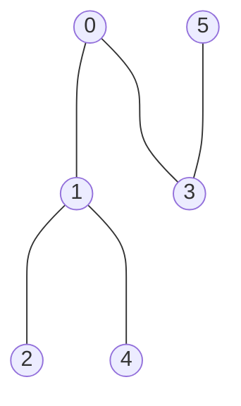
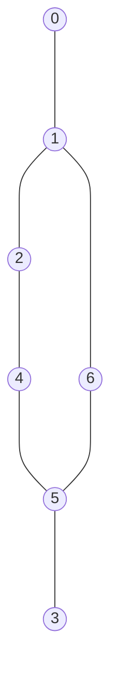

# Minimum Spanning Tree (MST)

## Purpose

The coding exercises are designed to test knowledge of the following concepts:

* Finding MST and its weight

## Overview

The coding exercises cover the following practical problems:
* Building MST using Kruskal's algorithm 
* Building MST using Prim's algorithm

## Coding exercises

### Exercise 1: Building MST using Kruskal's algorithm 

Given the number of vertices `n`, graph edges `edges` of an undirected weighted graph, implement the function below to find out the weight of MST using Kruskal's algorithm. 
Vertices are enumerated from `0` to `n-1`. Each edge in `edges` is a combination of indexes of the connected vertices and weight for this edge.

Expected algorithm complexity is O(MlogN), M - number of edges, M << n^2, where N - number of vertices.

If no MST exists, please, return None.

```python
class DisjointSets:
    """
    Interface for supporting disjoint sets.

    Please use any desired heuristics, but expected time complexity for union and finding sets
    should be no more than O(logN), where N - number of elements in the disjoint set.
    """

    def __init__(self):
        # Add more class attributes to support desired heuristics.
        self.parent = {}

    def make_set(self, key: int):
        """Creates a new set that is associated to a given key."""
        pass

    def find_set(self, key: int) -> int:
        """Returns a unique set identifier (key) of a given's key set."""
        pass

    def union_sets(self, first_key: int, second_key: int):
        """Joins two given sets into a new one."""
        pass


def kruskal_mst(n: int, edges: List[List[int]]) -> int:
    """
    Returns the weight of MST for an undirected weighted graph.
    Expected algorithm complexity is O(MlogN), M - number of edges, M << N^2, where N - number of vertices.
    Vertices are enumerated from 0 to N-1, there N - number of vertices.

    If no MST exists, please, return None.

    E.g. there is a graph with 5 vertices from 0 to 4 and list of edges
    [[0, 1, 1], [0, 2, 1], [2, 3, 5], [0, 3, 1], [2, 4, 7], [3, 4, 5]].
    Each edge is a combination of the indexes of the connected vertices and weight for this edge.
    MST is {(0,1), (0,2), (0,3), (3,4)} with weight 8.

    Parameters:
        n (int) : number of vertices in the graph, vertices are enumerated from 0 to n-1
        edges (List[Tuple[int, int, int]]): contains the indexes of the connected vertices and weight for this edge.
    Returns:
         int: weight of MST
    """
    pass
```

**Example 1:**

`n` = 5
`edges` = [[0, 1, 1], [0, 2, 1], [2, 3, 5], [0, 3, 1], [2, 4, 7], [3, 4, 5]]

Expected result: 8.

**Example 2:**

`n` = 3
`edges` = [[1, 0, 5], [2, 0, 10], [1, 2, 6]]

Expected result: 11.

Please use a template for the implementation (`tasks/mst_kruskal:kruskal_mst`).


### Exercise 2: Building MST using Prim's algorithm

Given the number of vertices `n`, graph adjacency weighted matrix `edges` for an undirected weighted graph, implement the function given below that returns the order of adding vertices to MST according to the Prim's algorithm and its weight. 
Expected algorithm complexity is O(N^2), N - number of vertices.
Vertices are enumerated from `0` to `n-1`.

Expected algorithm complexity is O(N^2), N - number of vertices.

Starting vertex should be 0. If there are several possible vertices to choose at any iteration, vertex with the smallest index should be added.  If no MST exists, please, return (None, None).

```python
def prim_mst(n: int, edges: List[List[int]]) -> int:
    """
    Returns the order of adding vertices to MST according to the Prim's algorithm and
    the weight of MST for an undirected weighted graph.
    Expected algorithm complexity is O(N^2), N - number of vertices.
    Vertices are enumerated from 0 to N-1, there N - number of vertices.

    Starting vertex should be 0.
    If there are several possible vertices to choose at any iteration,
    vertex with the smallest index should be added.
    If no MST exists, please, return (None, None).

    E.g. there is a graph with 5 vertices from 0 to 4 and adjacency matrix with weight
    [[0, 2, 0, 6, 0], [2, 0, 3, 8, 5], [0, 3, 0, 0, 7], [6, 8, 0, 0, 9], [0, 5, 7, 9, 0]].
    0 means absence of edge, positive value means edge existence and shows its weight.
    MST is {(0,1), (1,2), (0,3), (1,4)} with weight 16.
    Order of adding vertices to MST is [0, 1, 2, 4, 3].

    Parameters:
        n (int) : number of vertices in the graph, vertices are enumerated from 0 to n-1
        edges (List[List[int]): adjacency matrix
    Returns:
        List[int], int: order of adding vertices to MST, the weight of MST
    """
    pass
```

**Example 1:**

`n = 5`

`edges = [[0, 2, 0, 6, 0], [2, 0, 3, 8, 5], [0, 3, 0, 0, 7], [6, 8, 0, 0, 9], [0, 5, 7, 9, 0]]`

Expected result: `[0, 1, 2, 4, 3]`, `16`

**Example 2:**


`n = 5`

`edges = [[0, 1, 1], [0, 2, 1], [2, 3, 5], [0, 3, 1]]`

Expected result: `None`, `None`


Please use a template for the implementation (`tasks/mst_prim:prim_mst`).
